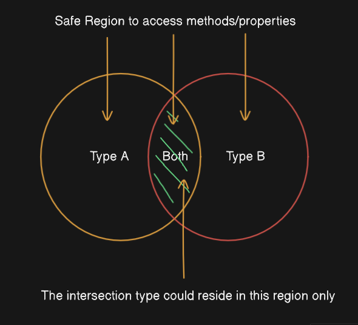

### Introduction

> The `union` and `intersection` in TypeScript is taken `type theory` and not set theory. They form the basis to merge existing types and form a new type.

### Key Points

1. `union` type is represented using a  `|`.

```js
type union = typeA | type B
```

2. The mental model for union should be that union type is not an `exlusive or`, which means that the particular union type doesn't mean `this or that`. As per above example, the union type could mean either `type A` or `type B` or `both`.


3. `intersection` type is represented by using a `&`.

```js
type intersection = typeA & typeB
```

4. The mental model for intersection should be that intersection is a `logical and`, which means that the particular intersection type would contain `typeA` and `typeB` at the same. 

